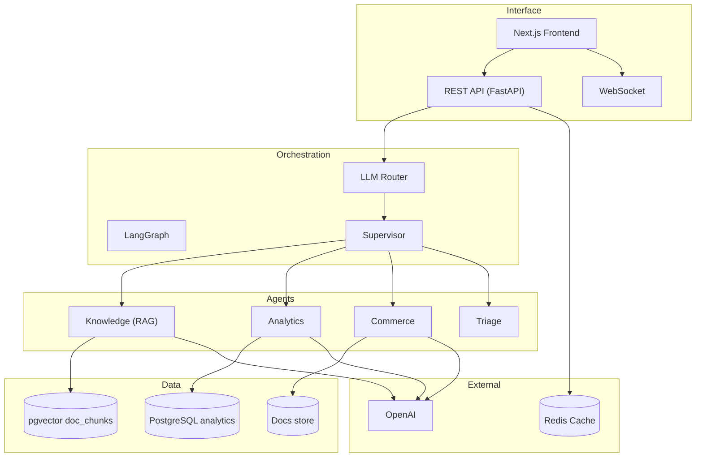

# E-Commerce AI Multi-Agent Assistant

[](https://python.org) [](https://langchain-ai.github.io/langgraph/) [](https://postgresql.org) [](https://nextjs.org) [](https://docker.com) [](https://openai.com)

> Multi-agent assistant for e-commerce analytics, knowledge retrieval (RAG), and commerce document processing, powered by LangGraph.

## Contents

- [Overview](#overview)
- [Quick Start](#quick-start)
- [Architecture](#architecture)
- [Agents](#agents)
- [API](#api)
- [Development](#development)
- [Documentation](#documentation)

---

## Overview

The E-Commerce AI Multi-Agent Assistant is a multi-agent system designed for e-commerce analytics, knowledge retrieval, and document processing. Built with LangGraph and powered by LLMs, it provides context-aware responses with multi-language support.

### Key Features

- **Multi-Agent Orchestration**: LLM-based semantic routing with supervisor guardrails
- **Semantic Routing**: Embedding-based routing with LLM classification (no keyword matching)
- **RAG Pipeline**: Vector search with re-ranking for precise answers with citations
- **SQL Generation**: Automatic SQL generation with allowlist validation and human approval gates
- **Document Processing**: Multi-format support (PDF/DOCX/TXT/OCR) with structured extraction
- **Multi-Language**: Support for multiple languages (PT-BR, EN-US, ES-ES, FR-FR, DE-DE) with automatic detection
- **Real-Time Chat**: WebSocket streaming for real-time responses
- **Security**: SQL allowlist validation, read-only transactions, and safety limits
- **Observability**: Structured logging, distributed tracing (OpenTelemetry), and metrics (Prometheus)

### Core Capabilities

- **Analytics Agent**: Converts natural language queries into SQL with data balancing
- **Knowledge Agent**: Retrieves and synthesizes information from document stores with citations
- **Commerce Agent**: Processes commercial documents with structured data extraction
- **Triage Agent**: Handles ambiguous queries with fallback and guidance

---

## Quick Start

### Docker (recommended)

```bash
# 1) Clone
git clone <repository-url>
cd ecommerce-ai-multiagent-assistant

# 2) Environment variables
cd backend
cp .env.example .env
# edit .env (OPENAI_API_KEY, DATABASE_URL, etc.)

# 3) Bootstrap
make bootstrap

# 4) Database setup
make db-setup
make db-seed  # Optional: sample data

# 5) Start development environment
make dev
```

The API will be available at `http://localhost:8000` and the frontend at `http://localhost:3000`.

### Local environment

```bash
# Dependencies
cd backend
poetry install
cd ../frontend
npm install

# Database
make db-setup
make db-seed

# Data ingestion
make ingest-pdfs    # Knowledge Agent
make ingest-csvs    # Analytics Agent

# Start services
make dev-backend    # Terminal 1
make dev-frontend   # Terminal 2
```

---

## Architecture



**Key decisions:**

- Semantic routing (no keyword matching)
- Fallbacks everywhere (no hard deps at import time)
- Settings via Pydantic + environment variables
- Human approval gates for SQL (interrupts) when enabled
- Multi-layer validation and security

---

## Agents

### Analytics

- **Planner**: NL → safe SQL (allowlist, no DDL/DML, prefix fix) with Chain-of-Thought reasoning
- **Executor**: read-only, timeout, row cap (with GROUP BY heuristic) and window functions support
- **Normalizer**: Expert-like multi-stage analysis (descriptive, interpretative, actionable insights)

### Knowledge (RAG)

- **Retriever**: pgvector over `doc_chunks` (1536 dims), light filters, per-doc dedupe
- **Ranker**: heuristic (overlap, phrase, length penalties) with optional LLM reranker
- **Answerer**: Multi-language answer with cross-validation, citations, and confidence calibration

### Commerce

- **Processor**: PDF/DOCX/TXT/Images with OCR (Tesseract) and fallbacks
- **Extractor (LLM)**: structured JSON Schema with Chain-of-Thought reasoning and self-consistency checks
- **Summarizer**: Executive multi-language view, risks and next steps with confidence calibration

### Triage

- Short multi-language reply when context is missing + objective follow-ups

---

## API

The E-Commerce AI Multi-Agent Assistant provides a comprehensive REST API and WebSocket support built with FastAPI and LangGraph integration.

### API Endpoints

| Endpoint | Method | Description |
|----------|--------|-------------|
| `/api/v1/chat/message` | POST | Send chat message and receive agent response |
| `/api/v1/chat/history` | GET | Get conversation history |
| `/api/v1/chat/history/{thread_id}` | DELETE | Clear conversation history |
| `/api/v1/chat/stream` | WebSocket | Real-time streaming chat |
| `/api/v1/documents/upload` | POST | Upload commerce document |
| `/api/v1/documents` | GET | List documents |
| `/api/v1/documents/{document_id}` | GET | Get document details |
| `/api/v1/documents/{document_id}` | DELETE | Delete document |
| `/api/v1/documents/{document_id}/analyze` | POST | Re-analyze document |
| `/api/v1/health` | GET | Health check |
| `/api/v1/health/ready` | GET | Readiness check |
| `/api/v1/health/live` | GET | Liveness check |

### Interactive Documentation

- **Swagger UI**: `http://localhost:8000/docs`
- **ReDoc**: `http://localhost:8000/redoc`

---

## Development

### Structure

```bash
backend/        # Python FastAPI backend
frontend/       # Next.js frontend
infrastructure/ # Docker, docker-compose
docs/           # Documentation
data/           # Datasets and storage
```

### Makefile (highlights)

```bash
# Bootstrap
make bootstrap              # Install dependencies (backend + frontend)
make bootstrap-backend      # Backend only
make bootstrap-frontend     # Frontend only

# Development
make dev                    # Start complete environment (Docker Compose)
make dev-backend            # Backend only
make dev-frontend           # Frontend only

# Database
make db-setup               # Setup database
make db-seed                # Seed with sample data
make db-reset               # Reset database

# Data ingestion
make ingest-pdfs            # Ingest PDFs for Knowledge Agent
make ingest-csvs            # Ingest CSVs for Analytics Agent

# Tests
make test                   # Run all tests
make test-unit              # Unit tests
make test-integration       # Integration tests
make test-e2e               # End-to-end tests

# Linting and formatting
make lint                   # Run linters
make format                 # Format code

# Build
make build                  # Production build
```

### Testing

- Unit: `tests/unit/*`
- Integration: `tests/integration/*`
- E2E: `tests/e2e/*`

```bash
make test
make test-unit
make test-integration
make test-e2e
```

---

## Documentation

Comprehensive documentation is available in the `docs/` directory:

### Development

- **[Setup Guide](docs/development/setup.md)** - Environment setup and installation
- **[API Documentation](docs/api/endpoints.md)** - Complete API reference with examples
- **[Operations](docs/operations/deployment.md)** - Deployment and operational procedures
- **[Troubleshooting](docs/operations/troubleshooting.md)** - Common issues and solutions

For the complete documentation index, see [docs/README.md](docs/README.md).

---

## License

This project is licensed under the MIT License - see the [LICENSE](LICENSE) file for details.
